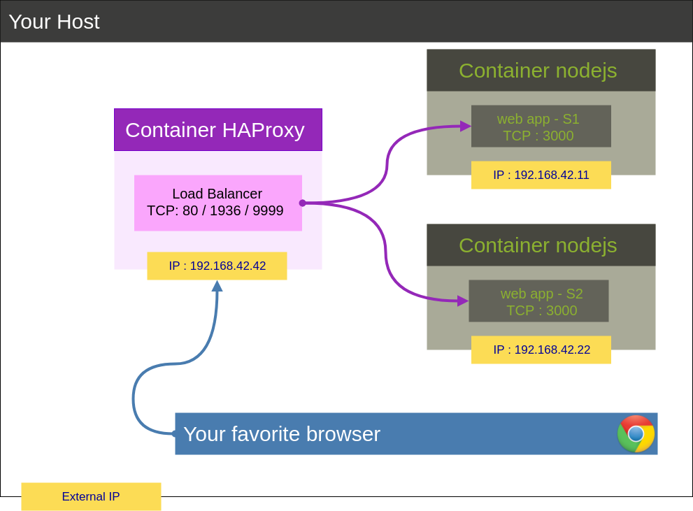
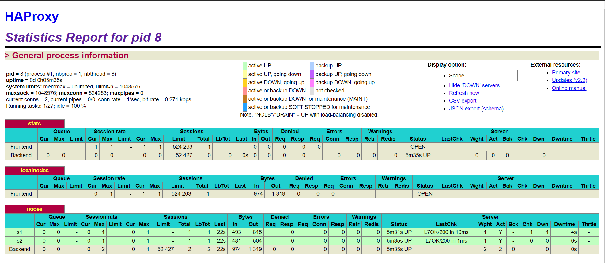
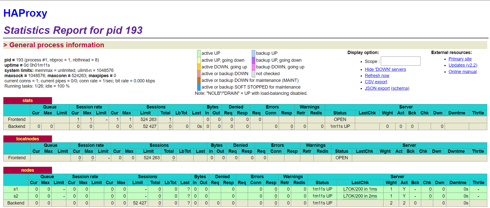

# 2020 HEIG-VD Administration IT
## Lab 04 : Docker
```
Author  : Loïc Lièvre - Yanick Thomann - Guillaume Schranz
Date    : Décembre 2021
```

# Table of content

0. [Identify issues and install the tools](#task-0)
1. [Add a process supervisor to run several processes](#task-1)
2. [Add a tool to manage membership in the web server cluster](#task-2)
3. [React to membership changes](#task-3)
4. [Use a template engine to easily generate configuration files](#task-4)
5. [Generate a new load balancer configuration when membership changes](#task-5)
6. [Make the load balancer automatically reload the new configuration](#task-6)

### Pedagogical objectives
* Build your own Docker images

* Become familiar with lightweight process supervision for Docker

* Understand core concepts for dynamic scaling of an application in production

* Put into practice decentralized management of web server instances

# An introduction describing briefly the lab

### <a name="task-0"></a>Task 0: Identify issues and install the tools
Architecture initiale 



#### Questions
1. <a name="M1"></a>**[M1]** Do you think we can use the current
   solution for a production environment? What are the main problems
   when deploying it in a production environment?

    ___
    En l'état l'infrastructure n'est pas adaptée à une utilisation en production. La charge étant balancée avec un seul load balancer sur deux noeuds uniquement, le risque de défaillance est relativement élevé. De plus les serveurs étant configurés directement dans le fichier de configuration HAProxy, ceci nous empêche de rendre le système dynamique et évolutif et impose des coupures en cas de modifications.
    ___

2. <a name="M2"></a>**[M2]** Describe what you need to do to add new
   `webapp` container to the infrastructure. Give the exact steps of
   what you have to do without modifiying the way the things are
   done. Hint: You probably have to modify some configuration and
   script files in a Docker image.

   ___
   Afin de pouvoir ajouter un nouveau container à l'infrastructure, il faut d'abord modifier le fichier _docker-compose.yml_ afin d'y ajouter un hôte supplémentaire. Ensuite on modifie le fichier _ha/config/haproxy.cfg_ pour y ajouter un noeud. Finalement on modifie le fichier _.env_ pour définir les variables d'environnement du nouveau container (nom et adresse IP)
   ___

3. <a name="M3"></a>**[M3]** Based on your previous answers, you have
   detected some issues in the current solution. Now propose a better
   approach at a high level.

    ___
    Avec le système tel que configuré actuellement, nous avons trop d'opérations à effectuer si on veut modifier sa configuration. Il nous faut pouvoir modifier la configuration des containers de manière dynamique sans devoir redémarrer toute l'infrastructure. Nous devons pouvoir rapidement ajouter ou modifier des containers sans causer d'interruption au système.
    ___

4. <a name="M4"></a>**[M4]** You probably noticed that the list of web
    application nodes is hardcoded in the load balancer
    configuration. How can we manage the web app nodes in a more dynamic
    fashion?

    ___
    Ne pouvant pas ajouter ou supprimer de noeud dynamiquement dans HAProxy, une idée serait de modifier la configuration actuelle pour déclarer plus de noeuds qu'il en existe en ce moment. Ainsi, on pourrait ajouter des nouveaux containers sans avoir à modifier la configuration de HAProxy. 
    ___

5. <a name="M5"></a>**[M5]** In the physical or virtual machines of a
   typical infrastructure we tend to have not only one main process
   (like the web server or the load balancer) running, but a few
   additional processes on the side to perform management tasks.

   For example to monitor the distributed system as a whole it is
   common to collect in one centralized place all the logs produced by
   the different machines. Therefore we need a process running on each
   machine that will forward the logs to the central place. (We could
   also imagine a central tool that reaches out to each machine to
   gather the logs. That's a push vs. pull problem.) It is quite
   common to see a push mechanism used for this kind of task.

   Do you think our current solution is able to run additional
   management processes beside the main web server / load balancer
   process in a container? If no, what is missing / required to reach
   the goal? If yes, how to proceed to run for example a log
   forwarding process?

   ___
   Actuellement, nos containers dockers ne sont pas configurés pour pouvoir gérer plusieurs processus. Il faudrait donc modifier leur configuration afin d'y ajouter un mécanisme d'envoi de logs à un serveur central qui devra lui aussi être mis en place. La commande serf se prête bien à cette fin
   ___

6. <a name="M6"></a>**[M6]** In our current solution, although the
   load balancer configuration is changing dynamically, it doesn't
   follow dynamically the configuration of our distributed system when
   web servers are added or removed. If we take a closer look at the
   `run.sh` script, we see two calls to `sed` which will replace two
   lines in the `haproxy.cfg` configuration file just before we start
   `haproxy`. You clearly see that the configuration file has two
   lines and the script will replace these two lines.

   What happens if we add more web server nodes? Do you think it is
   really dynamic? It's far away from being a dynamic
   configuration. Can you propose a solution to solve this?

    ___
    Si on ajoute d'autres noeuds, il faut ajouter, pour chaque nouveau serveur, une ligne dans le fichier _/ha/scripts/run.sh_, ce qui n'est pas dynamique du tout. Il faudrait configurer HAProxy de manière à pouvoir ajouter / supprimer dynamiquement des containers qui seraient créés ou supprimés. Encore ici, Serf serait l'outil à utiliser car il permet de [maintenir une liste de membres et notifier le load balancer en cas de modifications de ces derniers/](https://www.serf.io/intro/index.html).
    ___


**Delivrables**

1. Capture de la page de stats de HAProxy <http://192.168.42.42:1936>.



2. URL du repo

<https://github.com/schranzgu/Teaching-HEIGVD-AIT-2020-Labo-Docker>


### <a name="task-1"></a>Task 1: Add a process supervisor to run several processes

**Deliverables**

1. Capture de la page de stats de HAProxy <http://192.168.42.42:1936>. (devrait être similaire  la précédente).



2. Describe your difficulties for this task and your understanding of what is happening during this task. Explain in your own words why are we installing a process supervisor. Do not hesitate to do more research and to find more articles on that topic to illustrate the problem.

N'avons pas rencontré de difficulté particulière durant cette tâche.
Docker n'est pas fait pour avoir plusueurs process dans un seul container. De plus, par défaut le container va automatiquement s'arrêter lorsque le process se termine. Ainsi, si l'on prend Apache pour exemple qui va lancer des deamons en fond, l'arrêt du process principal va avoir pour conséquence de stopper les deamons également. Pour remédier à ce problème, il est possible d'utiliser un `init system` aussi appelé parfois `process supervisor`. Celui que nous avons utilisé s'appelle `s6`. Le but est d'utiliser s6 comme le process principal qui va à la fois tourner en permanance et qui  pourra lancer d'autres process. 
Nous avons finalement crée un dossier `service` pour HA et WebApp afin d'y placer les scripts de lancement pour que s6 puisse s'en charger.

### <a name="task-2"></a>Task 2: Add a tool to manage membership in the web server cluster

**Deliverables**:

1. Logs <https://github.com/schranzgu/Teaching-HEIGVD-AIT-2020-Labo-Docker/tree/master/logs/task2>

2. Give the answer to the question about the existing problem with the current solution.
   
Le problème est la dépendance envers HA lors de la création de nouveau node. En effet, si HA n'est pas lancé, les autres ne pourrons fonctionner car il dépendent de HA. Ainsi, le but ici est de pouvoir démarrer d'autres noeuds et qu'ils rejoignent un cluster indépendament des autres noeuds existants. 
Pour cela, nous utilisons un `cluster mambership management tool, Serf` (voir question suivante). Le but est que les nodes puissent communiquer entre eux directement. 

3. Give an explanation on how `Serf` is working. Read the official website to get more details about the `GOSSIP` protocol used in `Serf`. Try to find other solutions that can be used to solve similar situations where we need some auto-discovery mechanism.

L'idée ici est de créer un Cluster dans lequel les noeuds peuvent communiquer entre eux. Pour cela, tous les noeuds utilisent un agent Serf qui va se charger de créer ou de rejoindre un cluster. Pour communiquer, Serf utilise un Gossip protocal qui va broadcaster des messages au travers du cluster. Ainsi, tout le monde aura conscience des autres nodes existants ainsi que des ajouts ou suppressions de node. 

Concernant les alternatives, on peut par exemple citer ZooKeeper, Fabric, Consul, .... A noter que Kubernetes permet également de traiter de ce type de problème.


### <a name="task-3"></a>Task 3: React to membership changes

**Deliverables**:

1. Provide the docker log output for each of the containers:  `ha`, `s1` and `s2`.
   Put your logs in the `logs` directory you created in the previous task.

2. Provide the logs from the `ha` container gathered directly from the `/var/log/serf.log`
   file present in the container. Put the logs in the `logs` directory in your repo.

Les logs pour cette partie se trouve à l'adresse suivante <https://github.com/schranzgu/Teaching-HEIGVD-AIT-2020-Labo-Docker/tree/master/logs/task%203>


### <a name="task-4"></a>Task 4: Use a template engine to easily generate configuration files

**Deliverables**:

1. You probably noticed when we added `xz-utils`, we have to rebuild
   the whole image which took some time. What can we do to mitigate
   that? Take a look at the Docker documentation on
   [image layers](https://docs.docker.com/engine/userguide/storagedriver/imagesandcontainers/#images-and-layers).
   Tell us about the pros and cons to merge as much as possible of the
   command. In other words, compare:

  ```
  RUN command 1
  RUN command 2
  RUN command 3
  ```

  vs.

  ```
  RUN command 1 && command 2 && command 3
  ```

  There are also some articles about techniques to reduce the image
  size. Try to find them. They are talking about `squashing` or
  `flattening` images.

2. Propose a different approach to architecture our images to be able
   to reuse as much as possible what we have done. Your proposition
   should also try to avoid as much as possible repetitions between
   your images.

3. Provide the `/tmp/haproxy.cfg` file generated in the `ha` container
   after each step.  Place the output into the `logs` folder like you
   already did for the Docker logs in the previous tasks. Three files
   are expected.
   
   In addition, provide a log file containing the output of the 
   `docker ps` console and another file (per container) with
   `docker inspect <container>`. Four files are expected.
   
4. Based on the three output files you have collected, what can you
   say about the way we generate it? What is the problem if any?


### <a name="task-5"></a>Task 5: Generate a new load balancer configuration when membership changes

**Deliverables**:

1. Provide the file `/usr/local/etc/haproxy/haproxy.cfg` generated in
   the `ha` container after each step. Three files are expected.
   
   In addition, provide a log file containing the output of the 
   `docker ps` console and another file (per container) with
   `docker inspect <container>`. Four files are expected.

2. Provide the list of files from the `/nodes` folder inside the `ha` container.
   One file expected with the command output.

3. Provide the configuration file after you stopped one container and
   the list of nodes present in the `/nodes` folder. One file expected
   with the command output. Two files are expected.
   
    In addition, provide a log file containing the output of the 
   `docker ps` console. One file expected.

4. (Optional:) Propose a different approach to manage the list of backend
   nodes. You do not need to implement it. You can also propose your
   own tools or the ones you discovered online. In that case, do not
   forget to cite your references.

### <a name="task-6"></a>Task 6: Make the load balancer automatically reload the new configuration

Deliverables:

    Take a screenshots of the HAProxy stat page showing more than 2 web applications running. Additional screenshots are welcome to see a sequence of experimentations like shutting down a node and starting more nodes.

    Also provide the output of docker ps in a log file. At least one file is expected. You can provide one output per step of your experimentation according to your screenshots.

    Give your own feelings about the final solution. Propose improvements or ways to do the things differently. If any, provide references to your readings for the improvements.

    (Optional:) Present a live demo where you add and remove a backend container.


# A chapter named "Difficulties" where you describe the problems you have encountered and the solutions you found

# A conclusion
